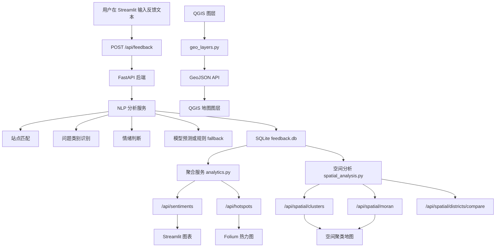

# Shanghai Transit Intelligence 项目完整讲解

> 课程：158.888 Information Technology Research Project  
> 项目主题：Geo-located NLP Feedback System for Public Transport  
> 当前实现：Streamlit 前端 + FastAPI 后端 + NLP 模型/规则基线 + SQLite + QGIS/GIS 空间分析  
> 案例城市：上海地铁网络

## 1. 项目一句话说明

本项目把乘客的自然语言反馈文本转化为结构化的交通问题数据，再把这些问题映射到上海地铁站点和地图空间中，用 dashboard 展示情绪分布、问题类别、投诉热点和空间聚类结果。

简单来说：

```text
乘客反馈文本
  -> NLP 识别站点、问题类别、情绪
  -> 存入数据库
  -> 聚合成统计和热点
  -> 在地图和图表中展示
  -> 支持交通规划者判断哪些站点/区域问题更集中
```

## 2. 项目目标

项目目标不是只做一个静态地图，也不是只训练一个 NLP 模型，而是做一个可运行的系统原型：

- 接收乘客反馈文本，例如“人民广场站今天晚点太严重了”。
- 自动识别反馈对应的地铁站点。
- 自动判断问题类别，例如 Delay、Crowding、Cleanliness。
- 自动判断情绪倾向，例如 positive、neutral、negative。
- 把分析结果保存到 SQLite 数据库。
- 通过 API 输出反馈记录、聚合情绪统计和负面反馈热点。
- 在 Streamlit dashboard 中展示地图、图表、热力图、空间分析和模型评估结果。
- 集成组员的 QGIS 数据，支持黄浦、虹口、浦东三个区域的公交站点、地铁站点和地铁线路图层。

## 3. 当前技术栈

| 层级 | 技术 | 作用 |
|---|---|---|
| 前端 | Streamlit | 交互式 dashboard、表单、图表、页面导航 |
| 地图 | Folium + streamlit-folium | 地铁网络、站点 marker、热力图、空间分析图层 |
| 地图底图 | 高德地图 AMap + OSM fallback | 上海地图底图，使用 GCJ-02 坐标 |
| 后端 | FastAPI | 提供 NLP、反馈存储、聚合统计、GIS 和空间分析 API |
| 数据库 | SQLite | 本地保存已处理的反馈记录 |
| NLP baseline | 规则关键词 + 站点字符串匹配 | 可解释、稳定的第一版 NLP 分析 |
| NLP model | TF-IDF char n-gram + Logistic Regression | 轻量机器学习模型，输出 category 和 sentiment |
| GIS | GeoPandas、Shapely、QGIS 导出文件 | 读取 QGIS 图层并转为 GeoJSON |
| 空间分析 | DBSCAN、Moran's I、Chi-square | 聚类、空间自相关、区级比较 |
| 评估 | scikit-learn、matplotlib | 模型指标、混淆矩阵、评估数据输出 |

## 4. 项目目录结构

核心目录如下：

```text
Project/
├── backend/
│   ├── app.py                         # FastAPI 后端入口
│   ├── schemas.py                     # API 输入输出结构定义
│   ├── db/
│   │   └── feedback.db                # SQLite 反馈数据库
│   ├── models/
│   │   ├── nlp_model.joblib           # 组合后的 NLP 模型
│   │   ├── category_model.joblib      # category 分类头
│   │   └── sentiment_model.joblib     # sentiment 分类头
│   └── services/
│       ├── nlp_baseline.py            # NLP baseline 与合成反馈生成
│       ├── ml_model.py                # 模型加载与预测封装
│       ├── feedback_store.py          # SQLite 读写
│       ├── analytics.py               # sentiment/hotspot 聚合
│       ├── geo_layers.py              # QGIS 图层读取与坐标转换
│       └── spatial_analysis.py        # DBSCAN、Moran's I、区级比较
│
├── frontend/
│   ├── app.py                         # Streamlit dashboard
│   └── shanghai_metro_data.py         # 上海地铁线路和关键站点坐标
│
├── training/
│   ├── train_nlp_model.py             # 训练并组装 NLP 模型
│   ├── train_sentiment.py             # sentiment 模型训练
│   ├── train_category.py              # category 模型训练
│   └── data_loaders/                  # 外部数据加载器
│
├── evaluation/
│   ├── evaluate_baseline.py           # 规则 baseline 评估
│   ├── evaluate_models.py             # 多模型比较评估
│   └── evaluate_spatial.py            # 空间分析评估
│
├── data/evaluation/                   # 模型指标、混淆矩阵、空间评估输出
├── qgis/QGIS/                         # 组员 QGIS 导出的 shp/gpkg 图层
├── docs/
│   ├── METHODS_EVIDENCE.md            # 方法与证据说明
│   ├── MODEL_CONTRACT.md              # 模型/API 输出契约
│   └── PROJECT_EXPLANATION.md         # 本文档
│
├── requirements.txt
└── readme.md
```

## 5. 总体系统架构



## 6. 数据流说明

### 6.1 用户提交一条反馈

用户在 dashboard 顶部输入：

```text
人民广场站今天晚点太严重了
```

前端调用：

```http
POST /api/feedback
Content-Type: application/json

{
  "text": "人民广场站今天晚点太严重了"
}
```

后端返回结构化结果：

```json
{
  "id": 1,
  "text": "人民广场站今天晚点太严重了",
  "station": "人民广场",
  "station_en": "People's Square",
  "lat": 31.2327,
  "lon": 121.4756,
  "category": "Delay",
  "sentiment": "negative",
  "confidence": 0.91,
  "matched_keywords": ["晚点", "严重"],
  "created_at": "2026-05-13 10:00:00"
}
```

### 6.2 数据进入数据库

后端会把 NLP 输出保存到 `backend/db/feedback.db` 的 `feedback` 表中。

最小字段包括：

- `id`
- `text`
- `station`
- `station_en`
- `lat`
- `lon`
- `category`
- `sentiment`
- `confidence`
- `matched_keywords`
- `created_at`

### 6.3 前端刷新统计

前端调用这些 API 获取最新数据：

- `/api/feedback`：原始已处理反馈列表
- `/api/sentiments`：按站点和类别聚合后的正/中/负统计
- `/api/hotspots`：负面反馈热力图点位
- `/api/spatial/clusters`：负面反馈空间聚类结果
- `/api/spatial/moran`：Moran's I 空间自相关结果
- `/api/spatial/districts/compare`：三区负面反馈率对比

## 7. 后端模块讲解

### 7.1 `backend/app.py`

这是 FastAPI 入口文件，负责注册所有 API endpoint。

主要职责：

- 启动时初始化 SQLite 数据库。
- 提供健康检查 API。
- 接收前端反馈文本。
- 调用 NLP 服务分析文本。
- 保存和读取反馈数据。
- 提供 sentiment、hotspot、GIS 和 spatial analysis API。

主要 endpoint：

| Endpoint | 方法 | 作用 |
|---|---|---|
| `/api/health` | GET | 检查后端是否在线 |
| `/api/model/status` | GET | 查看当前 NLP 模型是否加载、模型版本和指标 |
| `/api/stations` | GET | 返回 dashboard 使用的关键地铁站列表 |
| `/api/feedback` | POST | 提交一条反馈并返回 NLP 结果 |
| `/api/feedback` | GET | 返回已处理反馈列表 |
| `/api/sentiments` | GET | 返回 station/category/sentiment 聚合统计 |
| `/api/hotspots` | GET | 返回负面反馈热力图点位 |
| `/api/seed` | POST | 生成一批可复现的合成反馈 |
| `/api/analyse` | POST | 只分析文本，不写入数据库 |
| `/api/gis/districts` | GET | 返回可用 QGIS 区域 |
| `/api/gis/districts/{district}/boundary` | GET | 返回区边界 GeoJSON |
| `/api/gis/districts/{district}/bus-stops` | GET | 返回公交站点 GeoJSON |
| `/api/gis/districts/{district}/subway-stops` | GET | 返回地铁站点 GeoJSON |
| `/api/gis/districts/{district}/subway-lines` | GET | 返回地铁线路 GeoJSON |
| `/api/spatial/clusters` | GET | 返回 DBSCAN 聚类结果 |
| `/api/spatial/moran` | GET | 返回 Moran's I 结果 |
| `/api/spatial/districts/compare` | GET | 返回黄浦、虹口、浦东区级比较 |

### 7.2 `backend/schemas.py`

这里定义 API 的输入输出结构。它的作用是保证前后端字段稳定，不因为内部模型替换而破坏前端。

核心输出结构 `NLPResult`：

```text
text
station
station_en
lat
lon
category
sentiment
confidence
matched_keywords
```

其中：

- `category` 只能是：
  - `Delay`
  - `Crowding`
  - `Cleanliness`
  - `Safety`
  - `Noise`
  - `Accessibility`
  - `Other`
- `sentiment` 只能是：
  - `positive`
  - `neutral`
  - `negative`

### 7.3 `backend/services/nlp_baseline.py`

这是 NLP baseline 的核心。

它做四件事：

1. 站点识别  
   使用 `KEY_STATIONS` 中的中文站名和英文站名做字符串匹配。

2. 类别识别  
   使用关键词规则，例如：

   | 类别 | 示例关键词 |
   |---|---|
   | Delay | 晚点、延误、等很久、delay、late |
   | Crowding | 拥挤、人多、挤不上、packed |
   | Cleanliness | 干净、脏、垃圾、异味 |
   | Safety | 安全、危险、摔倒、推搡 |
   | Noise | 噪音、太吵、广播太响 |
   | Accessibility | 电梯、扶梯、无障碍、wheelchair |

3. 情绪识别  
   负面关键词优先，其次正面关键词，最后默认为 neutral。

4. 合成反馈生成  
   `/api/seed` 会调用 `generate_synthetic_feedback()`，生成可复现的 demo 数据。

### 7.4 `backend/services/ml_model.py`

这个模块负责加载机器学习模型：

```text
backend/models/nlp_model.joblib
```

当前模型 artifact 包含两个分类头：

- `category_model`
- `sentiment_model`

预测逻辑：

```text
输入 text
  -> category_model.predict(text)
  -> sentiment_model.predict(text)
  -> predict_proba 估计 confidence
  -> 返回 category / sentiment / model_confidence
```

如果模型文件不存在，系统不会崩溃，而是自动使用规则 baseline。

### 7.5 `backend/services/feedback_store.py`

这个模块负责 SQLite 数据库读写。

主要函数：

- `init_db()`：创建 feedback 表。
- `save_feedback(result)`：保存一条 NLP 结果。
- `list_feedback(limit)`：读取反馈记录。
- `clear_feedback()`：清空反馈表，用于 seed demo 数据。

### 7.6 `backend/services/analytics.py`

这个模块把数据库里的反馈转成前端需要的统计格式。

主要函数：

- `build_sentiment_aggregates()`  
  按 `station + category` 聚合 `positive / neutral / negative` 数量。

- `build_hotspot_points()`  
  只取有站点、有坐标、且情绪为 negative 的反馈，生成热力图点位。

热点权重逻辑：

```text
某站负面反馈数量 / 所有站点中最高负面反馈数量
```

所以 `weight` 是 0 到 1 之间的相对强度。

## 8. NLP 模型讲解

### 8.1 为什么保留规则 baseline

规则 baseline 的作用不是替代真实模型，而是提供一个稳定、可解释、可运行的系统集成基线。

它的优点：

- 不需要大模型依赖。
- 可以稳定跑通前后端。
- 方便解释为什么一个文本被分到某一类。
- 可以作为后续深度学习模型的对照组。

它的限制：

- 对新表达和隐含语义不够鲁棒。
- 依赖关键词，无法真正理解上下文。
- 容易被同义词、错别字、反讽、复杂句影响。

### 8.2 当前机器学习模型

当前模型是轻量级 split-head 模型：

| 分类头 | 任务 | 算法 |
|---|---|---|
| sentiment head | positive / neutral / negative | TF-IDF char 2-5 gram + Logistic Regression |
| category head | 7 类问题分类 | TF-IDF char 2-5 gram + Logistic Regression |

模型文件：

```text
backend/models/nlp_model.joblib
```

训练入口：

```bash
cd /Users/danielyang/Study/158888/Project
python3 training/train_nlp_model.py
```

只重新组装已有模型：

```bash
cd /Users/danielyang/Study/158888/Project
python3 training/train_nlp_model.py --assemble-only
```

### 8.3 模型和规则的关系

当前 `analyse_feedback()` 的逻辑是：

```text
先做 station 匹配
先做规则 category/sentiment 匹配，得到 matched_keywords
尝试调用 ML model
  如果模型可用：使用模型输出的 category 和 sentiment
  如果模型不可用：使用规则输出的 category 和 sentiment
最后计算 confidence
```

这样做的好处：

- 前端字段始终不变。
- 模型没训练好时系统仍然能运行。
- 后续替换成 Yifan 的模型或 HuggingFace 模型时，只需要改 `ml_model.py` 或 `nlp_baseline.py` 内部实现，不需要改前端。

## 9. 前端 dashboard 讲解

前端入口：

```text
frontend/app.py
```

前端是 Streamlit dashboard，包含以下主要区域。

### 9.1 顶部 Hero 区域

显示项目名称：

```text
Shanghai Transit Intelligence
```

下方说明：

```text
NLP-powered commuter feedback · real-time spatial analysis · Shanghai Metro Network
```

视觉风格已经调整成简约、深色、Apple-like 的玻璃质感卡片风格。

### 9.2 功能导航

当前有 5 个主页面：

| Tab | 作用 |
|---|---|
| Metro Network | 展示上海地铁网络、关键站点、QGIS 图层 |
| Sentiment Analysis | 展示情绪分类统计、负面反馈按站点分布 |
| Hotspot Detection | 展示负面反馈热力图和热点排名 |
| Spatial Insights | 展示 DBSCAN 聚类、Moran's I、区级比较 |
| Methods & Evaluation | 展示模型指标、混淆矩阵、OOD 数据和实时推理 |

### 9.3 Sidebar 控制区

侧边栏功能：

- 切换界面主题：Auto / Light / Dark。
- 查看后端连接状态。
- 刷新数据。
- 初始化合成反馈数据。
- 选择 District Focus。
- 是否显示 QGIS 公交站点。
- 是否显示关键地铁站点。
- 是否显示站名标注。
- 切换地图底图：高德标准、高德卫星、高德暗色。
- 筛选要显示的地铁线路。
- 查看模型状态和简要模型说明。

### 9.4 反馈输入表单

用户可以在页面顶部提交文本，例如：

```text
陆家嘴站很干净也很方便
```

提交后前端调用：

```http
POST /api/feedback
```

然后页面显示：

```text
NLP result: 陆家嘴 · Cleanliness · positive · confidence 0.xx
```

### 9.5 Metro Network 页面

展示内容：

- 地铁线路数量。
- 映射站点数量。
- 每日客流指标。
- 当前收集反馈数量。
- Folium 地铁网络地图。
- 线路图例。
- 关键换乘站表格。
- 可叠加 QGIS 区域边界、地铁线路、地铁站点、公交站点图层。

### 9.6 Sentiment Analysis 页面

展示内容：

- 总反馈数量。
- 负面反馈数量和比例。
- 最高关注问题类别。
- 监控站点数量。
- 按类别统计的 positive / neutral / negative 柱状图。
- 按站点排序的负面反馈条形图。
- 地图上的 sentiment bubble，圆圈越大表示负面反馈越多。

### 9.7 Hotspot Detection 页面

展示内容：

- 投诉点数量。
- Top hotspot。
- 检测到的站点聚类数量。
- 平均严重度。
- 负面反馈 heatmap。
- 站点 marker。
- hotspot ranking 表格。

### 9.8 Spatial Insights 页面

展示内容：

- DBSCAN 聚类控制：
  - cluster radius
  - min stations per cluster
  - category filter
- Moran's I 指标和 p-value。
- DBSCAN cluster centroid 和 cluster 图层。
- LISA 本地空间自相关分类：
  - HH：高-高热点
  - LL：低-低冷点
  - HL：高值被低值包围
  - LH：低值被高值包围
  - NS：不显著
- 黄浦、虹口、浦东三区负面反馈率卡方检验。

### 9.9 Methods & Evaluation 页面

展示内容：

- `model_comparison.csv` 模型比较表。
- OOD sentiment confusion matrix。
- OOD category confusion matrix。
- live inference 文本输入框。
- OOD test set 样本表格。
- sentiment/category 训练指标 JSON。

这个页面适合在展示或答辩时说明：

- 不是只做 UI，有模型评估证据。
- 不是只做 NLP，有 GIS 和空间统计。
- 系统能实时推理，并且可以解释当前模型限制。

## 10. GIS 和 QGIS 集成

QGIS 文件目录：

```text
Project/qgis/QGIS/
```

当前集成三个区域：

- Huangpu / 黄浦区
- Hongkou / 虹口区
- Pudong / 浦东新区

后端 `geo_layers.py` 读取以下类型数据：

| 图层 | 文件类型 | 用途 |
|---|---|---|
| district boundary | gpkg/shp | 区域边界 |
| subway lines | gpkg | 区内地铁线路 |
| subway stops | gpkg | 区内地铁站点 |
| bus stops | shp | 区内公交站点 |

坐标处理：

```text
QGIS 原始图层
  -> GeoPandas 读取
  -> 转为 EPSG:4326
  -> WGS-84 转 GCJ-02
  -> 输出 GeoJSON
  -> Folium 叠加到高德地图底图
```

为什么要转 GCJ-02：

- 高德地图使用 GCJ-02 坐标。
- 如果直接用 WGS-84，上海区域点位会和底图产生偏移。
- 所以后端统一转换后再给前端。

### 10.1 QGIS 数据处理流程

当前 QGIS 部分的可复现处理流程如下：

1. 在 QGIS 中导入行政区边界、地铁线路、地铁站点和公交站点数据。
2. 按研究范围裁剪出三个示范区域：
   - Huangpu / 黄浦区
   - Hongkou / 虹口区
   - Pudong / 浦东新区
3. 分别导出每个区域的空间图层：
   - district boundary：`.gpkg`
   - subway lines：`.gpkg`
   - subway stops：`.gpkg`
   - bus stops：`.shp`
4. 将导出的文件保存到：

```text
Project/qgis/QGIS/
```

5. 后端 `backend/services/geo_layers.py` 负责把本地 QGIS 文件映射到 API：
   - `Huangpu` -> `huangpu.gpkg`, `HP subway line.gpkg`, `HP subway stop.gpkg`, `huangpu_bus_stop.shp`
   - `Hongkou` -> `hongkou.gpkg`, `HK subway line.gpkg`, `HK subway stop.gpkg`, `hongkou_bus_stops_.shp`
   - `Pudong` -> `pudong.gpkg`, `PD subway line.gpkg`, `PD subway stop.gpkg`, `pudong_bus_stop.shp`
6. GeoPandas 读取图层后统一转为 WGS-84。
7. 后端再把几何坐标从 WGS-84 转换到 GCJ-02，以匹配 AMap。
8. API 返回 GeoJSON，前端 Folium 直接渲染这些图层。

实际读取验证结果：

| District | Boundary | Bus Stops | Subway Stops | Subway Lines |
|---|---:|---:|---:|---:|
| Huangpu | 1 | 330 | 63 | 50 |
| Hongkou | 1 | 332 | 31 | 38 |
| Pudong | 1 | 7251 | 940 | 734 |

## 11. 空间分析讲解

空间分析模块：

```text
backend/services/spatial_analysis.py
```

### 11.1 DBSCAN negative-feedback clustering

目标：

识别负面反馈在空间上是否形成聚集区域。

输入：

- 已匹配站点的反馈。
- 情绪为 negative 的记录。
- 每个站点的经纬度。

方法：

- 使用 Haversine 距离，适合经纬度距离计算。
- `eps_km` 控制聚类半径。
- `min_samples` 控制至少多少站点形成一个 cluster。

输出：

- GeoJSON FeatureCollection。
- 每个 cluster 的中心点、站点列表、总负面数量、负面率。

### 11.2 Moran's I

目标：

判断负面反馈率是否存在空间自相关。

简单解释：

- Moran's I > 0：相似值聚集，高负面站点倾向靠近高负面站点。
- Moran's I < 0：相似值分散，高负面站点倾向靠近低负面站点。
- p-value < 0.05：统计上更可能显著。

当前实现：

- 使用 KNN 构建空间权重矩阵。
- 每个站点计算负面率：

```text
negative / (positive + neutral + negative)
```

- 同时输出 LISA 分类，用于地图展示本地热点/冷点。

### 11.3 District comparison

目标：

比较黄浦、虹口、浦东三个区域的负面反馈率是否有显著差异。

方法：

- 根据站点坐标和 QGIS district boundary polygon 判断站点所属行政区。
- 如果本地 QGIS 文件读取失败，系统才回退到近似 bounding box，避免 API 直接崩溃。
- 构造 contingency table：

```text
district x [negative, non-negative]
```

- 使用 chi-square test。

输出：

- 每个 district 的 feedback 总数。
- positive / neutral / negative 数量。
- 负面率。
- chi-square statistic。
- p-value。
- 是否显著。

## 12. API 使用示例

### 12.1 健康检查

```bash
curl http://localhost:8000/api/health
```

期望：

```json
{"status":"ok"}
```

### 12.2 查看模型状态

```bash
curl http://localhost:8000/api/model/status
```

用于确认：

- 模型是否存在。
- 模型路径。
- 模型版本。
- 训练指标。

### 12.3 提交反馈

```bash
curl -X POST http://localhost:8000/api/feedback \
  -H "Content-Type: application/json" \
  -d '{"text":"人民广场站今天晚点太严重了"}'
```

期望结果：

```text
station = 人民广场
category = Delay
sentiment = negative
```

### 12.4 初始化 demo 数据

```bash
curl -X POST http://localhost:8000/api/seed \
  -H "Content-Type: application/json" \
  -d '{"count":420,"reset":true}'
```

### 12.5 获取情绪聚合

```bash
curl http://localhost:8000/api/sentiments
```

### 12.6 获取热点数据

```bash
curl http://localhost:8000/api/hotspots
```

### 12.7 获取空间聚类

```bash
curl "http://localhost:8000/api/spatial/clusters?eps_km=1.5&min_samples=2"
```

### 12.8 获取 Moran's I

```bash
curl "http://localhost:8000/api/spatial/moran?k=5"
```

## 13. 如何运行项目

### 13.1 安装依赖

```bash
cd /Users/danielyang/Study/158888
python3 -m pip install -r Project/requirements.txt
```

### 13.2 启动后端

```bash
cd /Users/danielyang/Study/158888/Project/backend
uvicorn app:app --reload --port 8000
```

浏览器或命令行检查：

```bash
curl http://localhost:8000/api/health
```

### 13.3 启动前端

另开一个 terminal：

```bash
cd /Users/danielyang/Study/158888
streamlit run Project/frontend/app.py --server.port 8502
```

打开：

```text
http://localhost:8502
```

### 13.4 初始化数据

方式一：前端 sidebar 点击“初始化数据”。

方式二：命令行调用：

```bash
curl -X POST http://localhost:8000/api/seed \
  -H "Content-Type: application/json" \
  -d '{"count":420,"reset":true}'
```

## 14. 如何重新训练模型

```bash
cd /Users/danielyang/Study/158888/Project
python3 training/train_nlp_model.py
```

训练后会更新：

```text
backend/models/sentiment_model.joblib
backend/models/category_model.joblib
backend/models/nlp_model.joblib
data/evaluation/ml_model_metrics.json
data/evaluation/sentiment_train_metrics.json
data/evaluation/category_train_metrics.json
```

如果只想把已有两个模型头重新打包：

```bash
python3 training/train_nlp_model.py --assemble-only
```

## 15. 如何重新跑评估

### 15.1 规则 baseline 评估

```bash
cd /Users/danielyang/Study/158888/Project
python3 evaluation/evaluate_baseline.py
```

### 15.2 多模型比较评估

```bash
cd /Users/danielyang/Study/158888/Project
python3 evaluation/evaluate_models.py
```

输出位置：

```text
data/evaluation/
```

关键输出：

- `model_comparison.csv`
- `model_comparison_full.json`
- `ood_results.json`
- `ood_confusion_category.png`
- `ood_confusion_sentiment.png`

### 15.3 空间分析评估

```bash
cd /Users/danielyang/Study/158888/Project
python3 evaluation/evaluate_spatial.py
```

关键输出：

- `spatial_cluster_map.png`
- `spatial_clusters.geojson`
- `spatial_moran.json`
- `spatial_evaluation_summary.json`

## 16. 当前项目符合要求的点

从 158.888 项目要求角度看，当前系统已经覆盖以下核心内容：

| 要求方向 | 当前实现 |
|---|---|
| 有明确 research prototype | 已实现可运行 dashboard + API |
| NLP 处理非结构化文本 | 支持反馈文本分类、情绪判断、站点匹配 |
| GIS / geolocation | 支持站点坐标、QGIS 图层、地图可视化 |
| 前后端分离 | Streamlit 前端通过 requests 调 FastAPI 后端 |
| 数据持久化 | SQLite 保存反馈记录 |
| 可演示 | `/api/seed` 可生成 demo 数据 |
| 可解释 baseline | 规则关键词和 matched_keywords 可解释 |
| 有模型 | TF-IDF + Logistic Regression split-head 模型 |
| 有评估证据 | OOD set、confusion matrix、model comparison |
| 有空间分析 | DBSCAN、Moran's I、chi-square district comparison |
| 有组员 QGIS 数据集成 | 黄浦、虹口、浦东 QGIS 图层已接入 |

## 17. 当前限制

需要在报告或展示中诚实说明：

1. 反馈数据主要是合成数据  
   当前系统用于系统集成验证，不能声称代表真实上海地铁乘客投诉分布。

2. NLP category 数据较依赖模板  
   模型可能学到关键词或模板模式，而不是真正深层语义。

3. OOD 表现有限  
   OOD macro-F1 明显低于 in-domain 结果，说明真实泛化能力仍需提升。

4. QGIS 区域覆盖有限  
   当前重点集成黄浦、虹口、浦东三个区域，不是完整上海所有区。

5. District assignment 已使用 QGIS polygon，但覆盖范围仍有限  
   当前只对三个 QGIS 示范区做 polygon containment；如果扩展到全上海，需要补齐所有行政区边界。

6. Streamlit 不是生产级前端框架  
   对课程项目和研究 prototype 足够，但正式部署可考虑 React/Vue + 地图 SDK。

## 18. 后续改进计划

### 18.1 NLP 改进

- 替换当前 TF-IDF 模型为 Yifan 的模型或 HuggingFace/BERT/RoBERTa。
- 保持 API 输出结构不变。
- 增加真实标注 transit feedback 数据。
- 增强中文分词、错别字、同义词、短文本鲁棒性。
- 增加 multi-label 分类，因为一条反馈可能同时包含 delay 和 crowding。

### 18.2 GIS 改进

- 扩展 QGIS 数据到更多上海行政区。
- 加入 POI、人口密度、换乘强度、道路/公交可达性指标。
- 把 QGIS 输出流程写成可复现 pipeline。

### 18.3 空间分析改进

- 使用真实站点客流量作为归一化分母。
- 负面率可按时间窗口分析，例如早高峰、晚高峰、工作日、周末。
- 引入 Getis-Ord Gi* 热点分析。
- 增加时间序列异常检测。

### 18.4 系统工程改进

- 增加自动化测试。
- 增加 Docker Compose 一键启动。
- 增加数据库 migration。
- 增加 API authentication。
- 增加部署说明。

## 19. 演示讲解顺序建议

如果要向老师或组员讲解，可以按这个顺序：

1. 先讲项目问题  
   公共交通反馈是非结构化文本，难以直接用于地图和规划决策。

2. 讲系统目标  
   用 NLP 把文本变成结构化问题，再用 GIS 定位到站点和区域。

3. 展示 dashboard 首页  
   说明系统已经是可运行 prototype，不只是 notebook。

4. 提交一条反馈  
   输入“人民广场站今天晚点太严重了”，展示 station、category、sentiment。

5. 展示 Sentiment Analysis  
   说明如何从单条反馈聚合到站点和类别统计。

6. 展示 Hotspot Detection  
   说明负面反馈如何变成地图热力图。

7. 展示 Spatial Insights  
   说明 DBSCAN、Moran's I、district comparison。

8. 展示 Methods & Evaluation  
   说明模型不是黑箱，有 OOD 测试、混淆矩阵和限制分析。

9. 最后讲 limitation 和 future work  
   强调当前是 research prototype，后续可以替换更强 NLP 模型和真实数据。

## 20. 关键文件速查

| 想看什么 | 文件 |
|---|---|
| 前端 dashboard | `Project/frontend/app.py` |
| 地铁站点和线路数据 | `Project/frontend/shanghai_metro_data.py` |
| FastAPI 后端入口 | `Project/backend/app.py` |
| API schema | `Project/backend/schemas.py` |
| NLP baseline | `Project/backend/services/nlp_baseline.py` |
| ML 模型加载 | `Project/backend/services/ml_model.py` |
| SQLite 存储 | `Project/backend/services/feedback_store.py` |
| 聚合统计 | `Project/backend/services/analytics.py` |
| QGIS 图层读取 | `Project/backend/services/geo_layers.py` |
| 空间分析 | `Project/backend/services/spatial_analysis.py` |
| 模型训练 | `Project/training/train_nlp_model.py` |
| 模型评估 | `Project/evaluation/evaluate_models.py` |
| 空间评估 | `Project/evaluation/evaluate_spatial.py` |
| 方法证据说明 | `Project/docs/METHODS_EVIDENCE.md` |
| 模型契约 | `Project/docs/MODEL_CONTRACT.md` |

## 21. 一句话总结

当前项目已经从最初的单体 Streamlit dashboard，升级为一个完整的 NLP + GIS 系统原型：前端负责交互展示，后端负责 NLP 推理、数据存储、聚合统计和空间分析，QGIS 数据作为空间图层补充，模型评估和空间评估结果可以直接支撑课程报告与演示。
